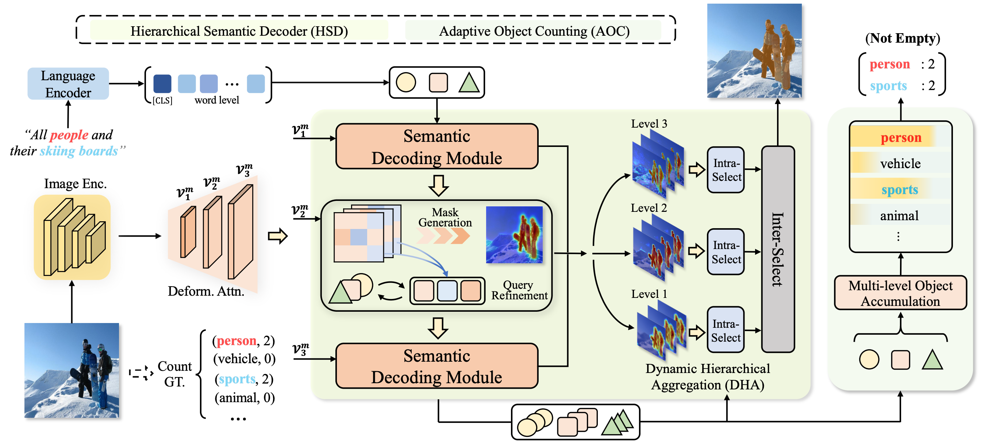

# ✂CoHD: A Counting-Aware🔢 Hierarchical Decoding Framework for Generalized Referring Expression Segmentation

[Zhuoyan Luo*](https://robertluo1.github.io/), [Yinghao Wu*](https://scholar.google.com/citations?user=lg9s6u8AAAAJ&hl=en), [Tianheng Cheng](https://scholar.google.com/citations?user=PH8rJHYAAAAJ&hl=zh-CN), [Yong Liu](https://workforai.github.io/), [Yicheng Xiao](https://easonxiao-888.github.io/), [Hongfa Wang](https://scholar.google.com.hk/citations?user=q9Fn50QAAAAJ&hl=zh-CN), [Xiao-Ping Zhang](https://sites.google.com/view/xiaopingzhang/home), [Yujiu Yang](https://scholar.google.com.hk/citations?user=4gH3sxsAAAAJ&hl=th)

Tsinghua University

<a href='https://arxiv.org/pdf/2405.15658'></a>

[](https://paperswithcode.com/sota/generalized-referring-expression-segmentation?p=hdc-hierarchical-semantic-decoding-with-1)

## 🔥 Updates

- [2024/05/27] The code is coming soon.

## 📖 Abstract
The newly proposed Generalized Referring Expression Segmentation (GRES) amplifies the formulation of classic RES by involving complex multiple/non-target scenarios.
Recent approaches address GRES by directly extending the well-adopted RES frameworks with object-existence identification. However, these approaches tend to encode multi-granularity object information into a single representation, which makes it difficult to precisely represent comprehensive objects of different granularity. Moreover, the simple binary object-existence identification across all referent scenarios fails to specify their inherent differences, incurring ambiguity in object understanding. To tackle the above issues, we propose a $\textbf{Co}$unting-Aware $\textbf{H}$ierarchical $\textbf{D}$ecoding framework (CoHD) for GRES. By decoupling the intricate referring semantics into different granularity with a visual-linguistic hierarchy, and dynamic aggregating it with intra- and inter-selection, CoHD boosts multi-granularity comprehension with the reciprocal benefit of the hierarchical nature. Furthermore, we incorporate the counting ability by embodying multiple/single/non-target scenarios into count- and category-level supervision, facilitating comprehensive object perception. Experimental results on gRefCOCO, Ref-ZOM, R-RefCOCO, and RefCOCO benchmarks demonstrate the effectiveness and rationality of CoHD which outperforms state-of-the-art GRES methods by a remarkable margin.

## 📗 FrameWork
<p align="center">

</p>

## 🍺 Visualizations
<tr>
<p align="center">

</p>
</tr>


## ❤️ Acknowledgement
Code in this repository is built upon several public repositories. Thanks for the wonderful work [ReLA](https://github.com/henghuiding/ReLA)! !

## ⭐️ BibTeX
if you find it helpful, please cite
```
@article{luo2024cohd,
  title={CoHD: A Counting-Aware Hierarchical Decoding Framework for Generalized Referring Expression Segmentation},
  author={Luo, Zhuoyan and Wu, Yinghao and Cheng Tianheng and Liu, Yong and Xiao, Yicheng and Wang Hongfa and Zhang, Xiao-Ping and Yang, Yujiu},
  journal={arXiv preprint arXiv:2405.15658},
  year={2024}
}
```


