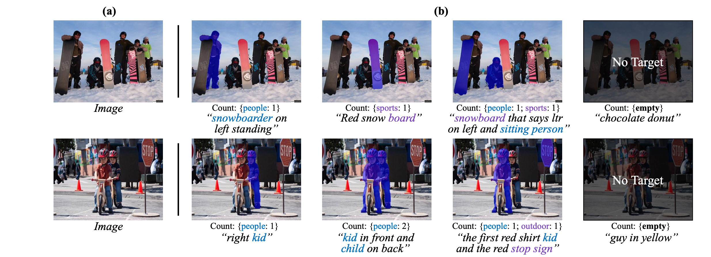

# ✂CoHD: A Counting-Aware🔢 Hierarchical Decoding Framework for Generalized Referring Expression Segmentation

[Zhuoyan Luo*](https://robertluo1.github.io/), [Yinghao Wu*](https://scholar.google.com/citations?user=lg9s6u8AAAAJ&hl=en), [Tianheng Cheng](https://scholar.google.com/citations?user=PH8rJHYAAAAJ&hl=zh-CN), [Yong Liu](https://workforai.github.io/), [Yicheng Xiao](https://easonxiao-888.github.io/), [Hongfa Wang](https://scholar.google.com.hk/citations?user=q9Fn50QAAAAJ&hl=zh-CN), [Xiao-Ping Zhang](https://sites.google.com/view/xiaopingzhang/home), [Yujiu Yang](https://scholar.google.com.hk/citations?user=4gH3sxsAAAAJ&hl=th)

Tsinghua University And Tencent

<a href='https://arxiv.org/pdf/2405.15658'></a>

## 🔥 Updates
- [2025/08/17] 🔥🔥🔥 The training code and checkpoints are released.
- [2025/06/28] 🔥🔥🔥 COHD is accepted by ICCV 2025.
## 📖 Abstract
The newly proposed Generalized Referring Expression Segmentation (GRES) amplifies the formulation of classic RES by involving complex multiple/non-target scenarios.
Recent approaches address GRES by directly extending the well-adopted RES frameworks with object-existence identification. However, these approaches tend to encode multi-granularity object information into a single representation, which makes it difficult to precisely represent comprehensive objects of different granularity. Moreover, the simple binary object-existence identification across all referent scenarios fails to specify their inherent differences, incurring ambiguity in object understanding. To tackle the above issues, we propose a **Co**unting-Aware **H**ierarchical **D**ecoding framework (CoHD) for GRES. By decoupling the intricate referring semantics into different granularity with a visual-linguistic hierarchy, and dynamic aggregating it with intra- and inter-selection, CoHD boosts multi-granularity comprehension with the reciprocal benefit of the hierarchical nature. Furthermore, we incorporate the counting ability by embodying multiple/single/non-target scenarios into count- and category-level supervision, facilitating comprehensive object perception. Experimental results on gRefCOCO, Ref-ZOM, R-RefCOCO, and RefCOCO benchmarks demonstrate the effectiveness and rationality of CoHD which outperforms state-of-the-art GRES methods by a remarkable margin.

## 📗 FrameWork
<p align="center">

</p>

## 🍺 Visualizations<tr>
<p align="center">

</p>
</tr>

## 📖 Implementations

### 🛠️ Installation
**Env**: The code is training using ```CUDA 11.3``` ```torch 1.12.1``` ```torchvision 0.13.1``` ```Python 3.8.8``` (other versions may also be fine)

**Dependencies**:
1. Install [Detectron2](https://github.com/facebookresearch/detectron2)
2. Run ```sh make.sh``` under ```gres_model/modeling/pixel_decoder/ops```
3. Install other required packages: ```pip install -r requirements.txt```
  
**Dataset**:

Please download the annotations from [Dataset](https://huggingface.co/RobertLuo1/CoHD/tree/main)
```
dataset
├── grefcoco
│   ├── grefs(unc).json
│   ├── instances.json
│   ├── cateid2coco.json
│   ├── cocoidtosuper.json
└── images
    └── train2014
        ├── COCO_train2014_xxxxxxxxxxxx.jpg
        ├── COCO_train2014_xxxxxxxxxxxx.jpg
        └── ...
```

### ⚡ Training & Evaluation
Note that, prepare the Swin-Base and Swin-Tiny pretrained model according to [RELA](https://github.com/henghuiding/ReLA) 

🚀 Training Scripts
- Swin-Base
```
bash scripts/grefcoco/train_base.sh
```
- Swin-Tiny
```
bash scripts/grefcoco/train_tiny.sh
```

🚀 Evaluation Scripts
- Swin-Base
```
bash scripts/grefcoco/eval_base.sh
```
- Swin-Tiny
```
bash scripts/grefcoco/eval_tiny.sh
```

### 🍺 Model And Performance
- Grefcoco Validation Set
  
|Method|Backbone|gIoU|cIoU|N-acc.|Checkpoint|
|:----:|:------:|:--:|:--:|:----:|:--------:|
| CoHD | Swin-T | 65.89 | 62.95 | 60.96 | [Model](https://huggingface.co/RobertLuo1/CoHD/blob/main/CoHD_grefcoco_swin_tiny.pth)
| CoHD | Swin-B | 68.42 | 65.17 | 63.38 | [Model](https://huggingface.co/RobertLuo1/CoHD/blob/main/CoHD_grefcoco_swin_base.pth)

## 🎤 TODO
- [ ] Release RefZOM training and evaluation script
- [ ] Release R-RefCOCO training and evaluation script
- [ ] Relase Refcoco training and evaluation script

## ❤️ Acknowledgement
Code in this repository is built upon several public repositories. Thanks for the wonderful work [ReLA](https://github.com/henghuiding/ReLA)! !

## ⭐️ BibTeX
if you find it helpful, please cite
```
@article{luo2024cohd,
  title={CoHD: A Counting-Aware Hierarchical Decoding Framework for Generalized Referring Expression Segmentation},
  author={Luo, Zhuoyan and Wu, Yinghao and Cheng Tianheng and Liu, Yong and Xiao, Yicheng and Wang Hongfa and Zhang, Xiao-Ping and Yang, Yujiu},
  journal={arXiv preprint arXiv:2405.15658},
  year={2024}
}
```


